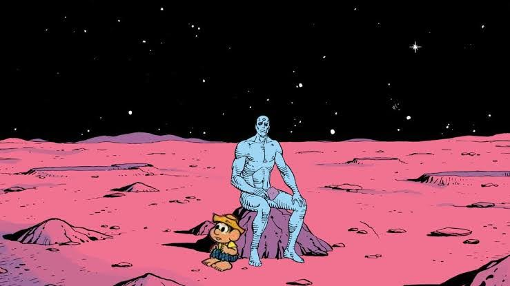
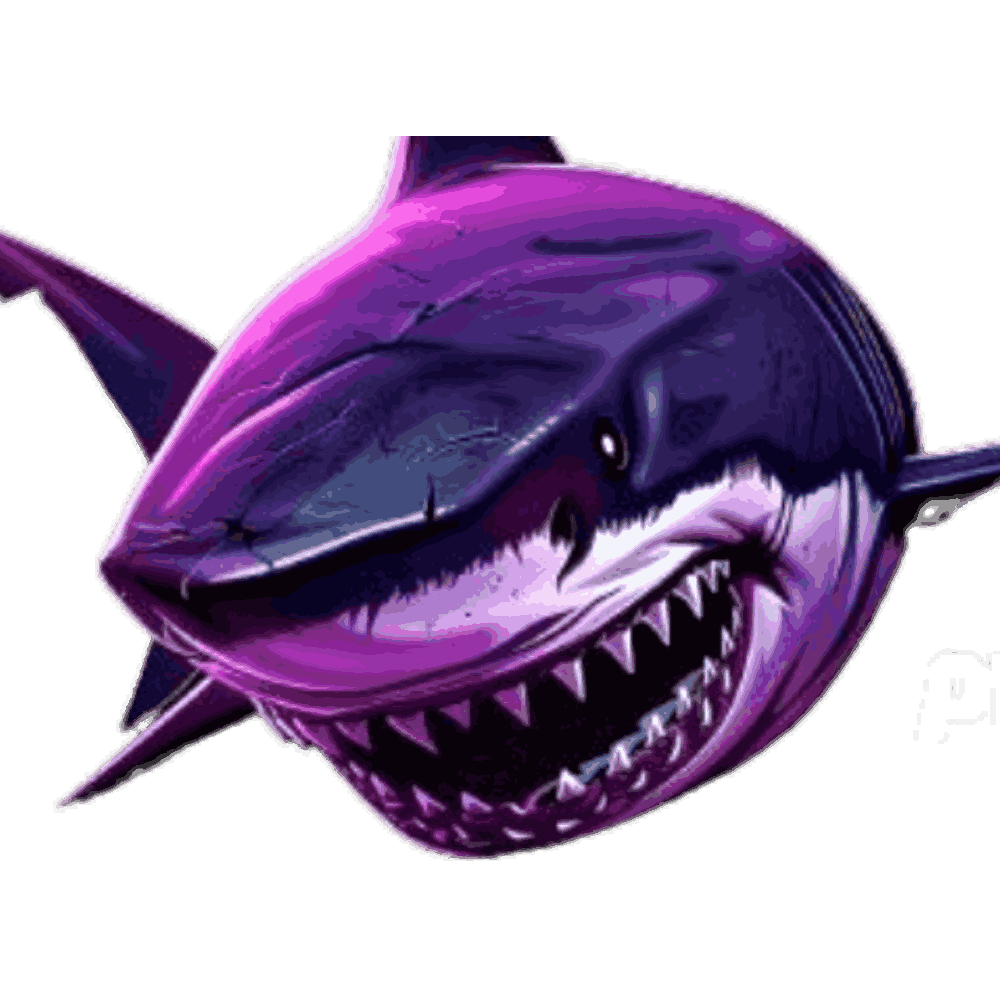
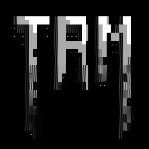
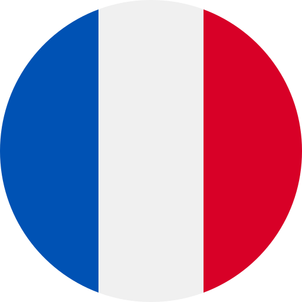

<h2>
  
  Olá, Ciao, 你好, Hi, Bonjour, Hola
</h2>

Our world is a world of people. Mankind has effectively eradicated any supernatural beings: mythical beings, folkoric creatures, gods - even the monotheistic God. Mankind has even given up hope of contact with extraterrestrial civilizations, though little green men have been among us for some time already, paying us visits in their flying saucers. Only Man remains. And Man looked around and realized he was alone.

In his loneliness, Man felt the emptiness within him and started to repopulate it with beings other than himself. That is how artificial intelligence was created - from simple, deterministic robots obedient to their human masters, to becoming more intelligent and independent than Man could ever conceive. The unpredictability and power of artificial intelligence was greeted by Man with apprehension, but also with joy. Finally! Spirits and elemental forces have once again returned to our world! We could catalogue them - construct a hierarchy. We could fence them off behind the Blackwall and draw a new line between what is natural and supernatural - here is the Earth and here is the sky. How painful Man's solitude must have been if he had to create a palpable, technological mythology and surrender to the demons of his own creation!

<h2>
  
  Veja, Vedi, 看看, See, Voir, Ver
</h2>

<table>
  <tr>
    <td align="center" width="200">
      <a href="https://boitatech.com/">
        
         
        Boitatech
      </a>
    </td>
    <td align="center" width="200">
      <a href="https://bruce.computer/">
        
         
        Bruce Firmware
      </a>
    </td>
    <td align="center" width="200">
      <a href="https://tramoia.sh/">
        
         
        Tramoia.sh
      </a>
    </td>
  </tr>
 
</table>

<h2>
  
  Outro, Altro, 其他, Other, Autre, Otro
</h2>

<table width="100%">
  <tr>
    <td align="left">
      <table>
        <tr>
          <td></td>
          <td></td>
          <td></td>
        </tr>
        <tr>
          <td></td>
          <td></td>
          <td></td>
        </tr>
      </table>
    </td>
    <td align="left">
      Visitor Counter:
      
    </td>
  </tr>
</table>
